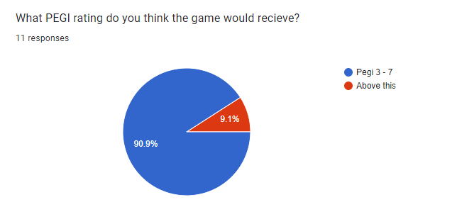

# 1.2 Stakeholders

## Customer Role&#x20;

As mentioned in the prior section of analysis, [1.1](1.1-problem-identification.md), the video game industry is large- there is a lot of money to be made and a lot of people to sell to. This draws a lot of attraction from large companies and businesses, where there is high demand there needs to be high supply.&#x20;

So who is making this market profitable? Where are the customers from, where do they play, how old are they in general- I want to find out about the general demographic of the customers to the gaming marketplace, eventually using this to understand the way game companies monopolise on the market.

<figure><figcaption>
<a href="../reference-list.md">Chart</a>
</figcaption></figure>

<figure><figcaption>
<a href="../reference-list.md">Table</a>
</figcaption></figure>

Chart one demonstrates what has already been stated in the [Problem Identification](1.1-problem-identification.md), the gradual and steady increase in the number of people playing video games, with an expected and continual growth in the value of the market. Table two represents the amount of people playing video game in each market versus the amount of revenue generated. We can see, thanks to (WWW Document 2018) that a market with more players doesn't necessarily mean more revenue as it depends on the price of the game and more that is decided by the company in that country. We can clearly see a close battle between America and China for most revenue earnt, however in terms of regions, it is clear that Asian countries make up three of the top four. I believe this answers two of my questions: where the majority of players are playing from and who is making the market profitable. &#x20;

This shows the potential for support for my game- I am not entering a niche market, the biggest difficulty would be creating a game advanced enough to stand out from others. According to Wikipedia, there are a total 59 educational video games: this means that the market is small but has potential as a game of quality would be able to stand out.&#x20;

## Demographics

<figure><figcaption>
<a href="../reference-list.md">Graph</a>
</figcaption></figure>

"Video gaming is no longer a hobby exclusively enjoyed by the young" says J.Clement. As the Graph shows: the man is not wrong. This information shocked me as I believed the age demographic would be heavily shifted towards the under 18 years demographic due to the availability of devices for younger customers and the amount of free time (Statista, 2022). The second half of the graph definitely follows the trend I would expect, decreasing in proportion to the  age. Using this information is still reassuring- My game is still going to be leaning towards the second largest demographic and If I can create a challenging enough game I believe it may draw in the 18-34 demographic.

### PEGI

<figure><figcaption>
<a href="../reference-list.md">PEGI ratings </a>
</figcaption></figure>

Linking back to my previous point is the idea of the PEGI rating system, a way for customers to rapidly see the appropriateness of the game for them and their age demographic. In the UK, it is illegal to sell a PEGI rated game to someone who is below the age required to play the game, creating a way of stopping the younger generation from accessing games they shouldn't yet. I believe this will work with my game, as I tend to make the game with simple features and childish graphics, meaning I hope my game will end up around a PEGI 3, probably a PEGI 7. (VSC Rating Board).&#x20;
